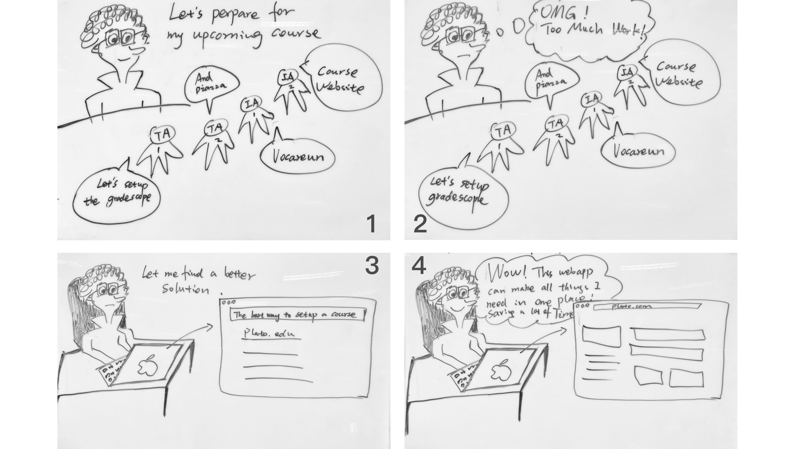
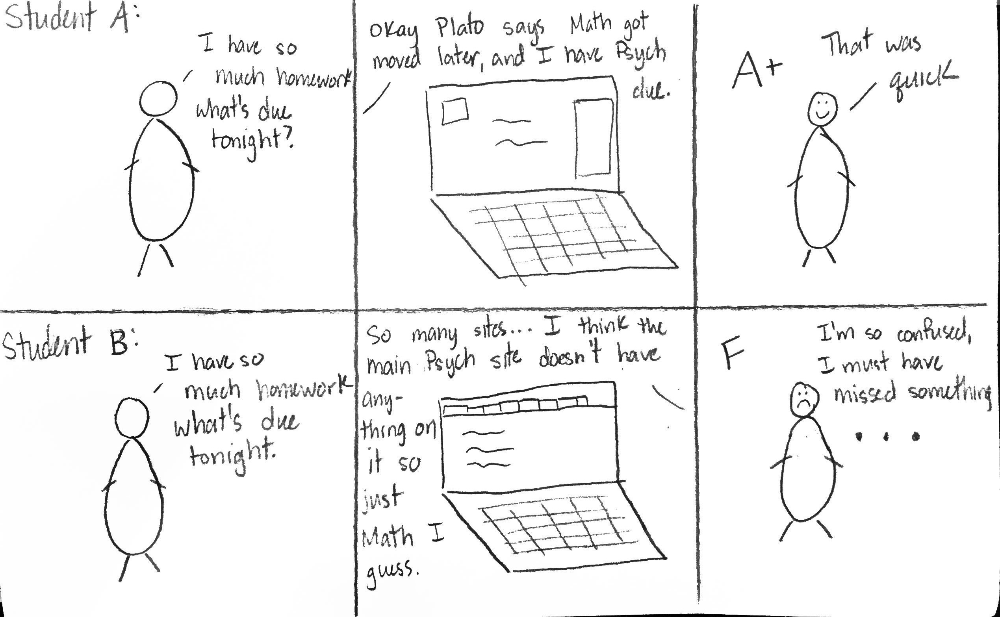
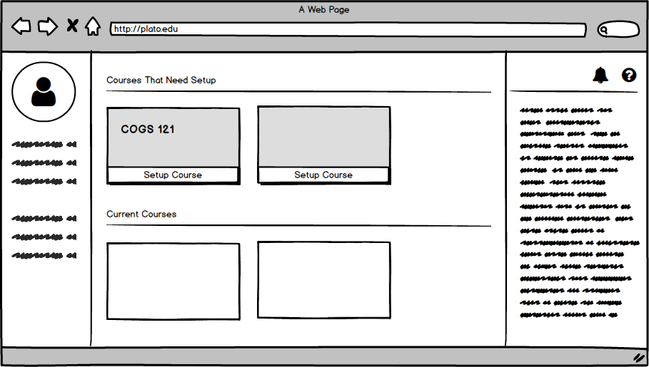
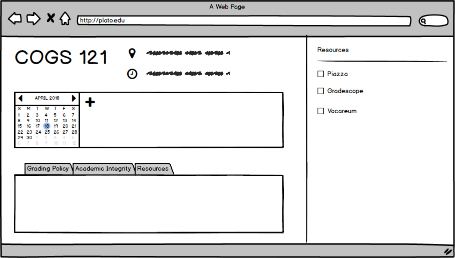
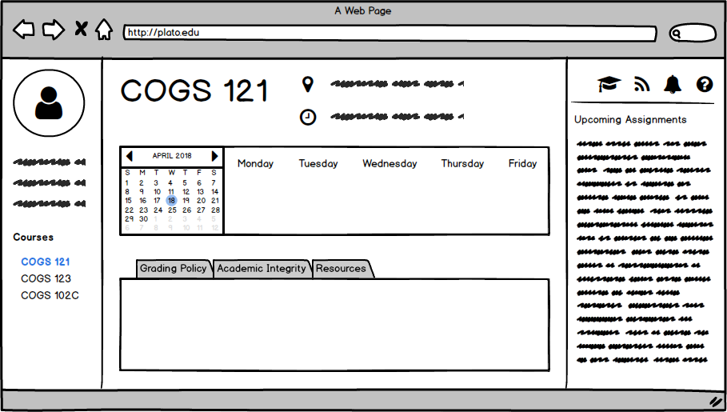
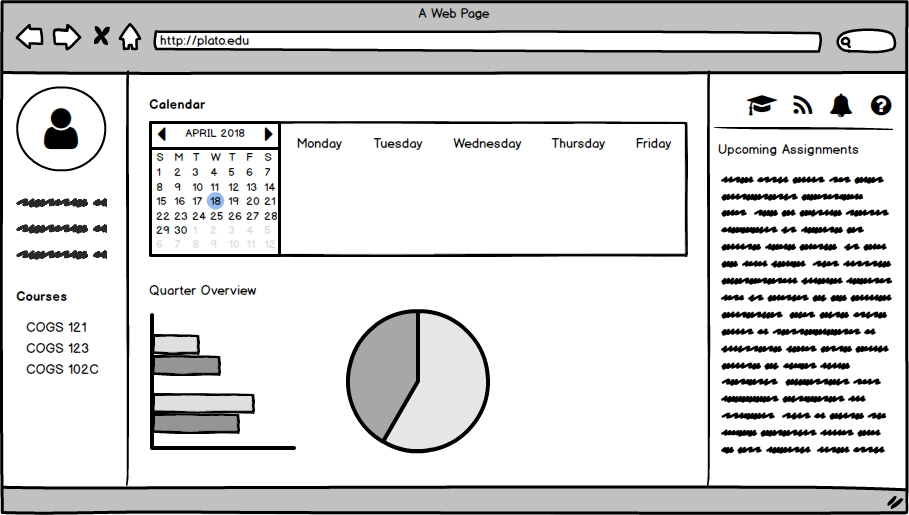
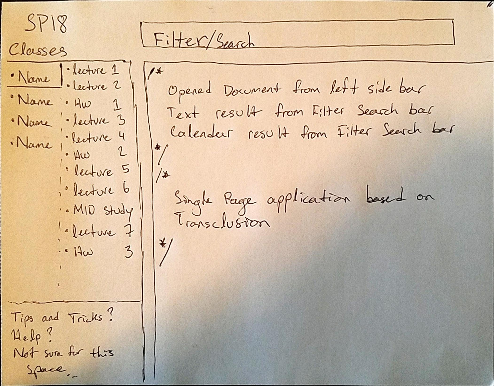

## Storyboard 1 
This storyboard represents the problem/solution from the instructor's point of view

## Storyboard 2
This storyboard represents the problem/solution from the student's point of view

Without Plato, students are subjected to different and nonstandard platforms for classes, resulting in confusion among deadlines, requirements, etc. Plato
    allows everything to be in one place with all resources ready at hand and aggregated due dates, assignments, etc in one easy-to-see place.

---

## Prototype 1

Instructors home page

Instructors course creation page

Students home page

Students specific course overview page

## Prototype 2

A single page application to to manage viewing and filtering through class content in multiple Personal Information Management styles. This keeps a student in one place with easy access to related content through multiple options to express their thought or understood connection between sources of information.

