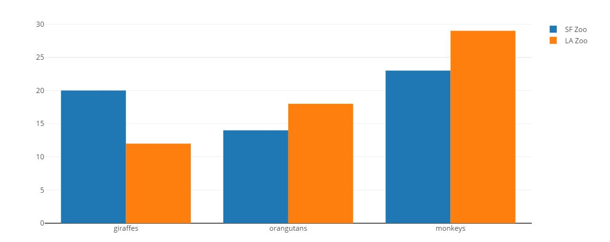
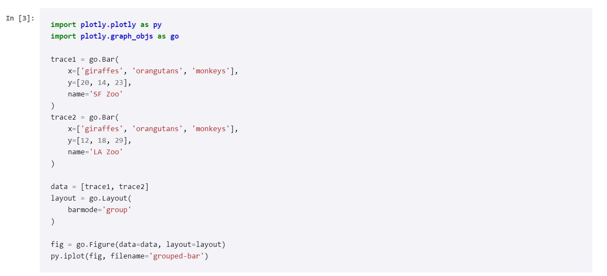

## Screenshots of latest UI

## Improvements on UI from last time

We have stuck with what we have from the last couple weeks of development and we have decided where we want the datavis to go in our project. That was the main improvement from the last week.

We have focused on this calendar as an organizational visualization for the data in our project. We would also like to continue with a second progress visualization based on assignments. It is currently being used to display the data that our dashboard is attempting to make more accessible to the user than the standard syllabus one dimentional list of links.

## Screenshots of data visualization
We haven't gotten to implement a data visualization ourselves but we do have a goal of how we want to set it up and what we want to display

## What's going on with the data visualization?

We want our data visualisation to make it easy for students to see how much work is left in each class by displaying the amount of work for different categories in different classes. 

## demo

