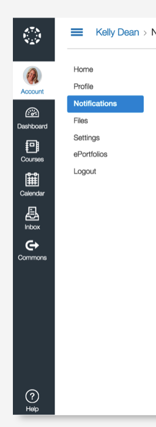
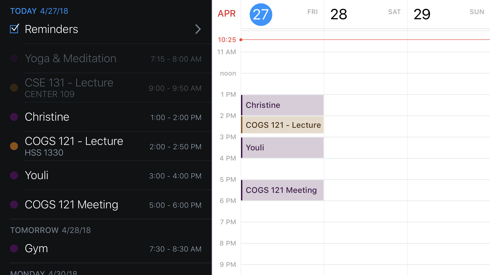

# Plato - Modern LMS

Plato is a modern learning management system that serves as the access point to any course information and resources. Plato integrates with 3rd party applications such as Gradescope, Piazza and Vocareum to provide students with a centralized place to access their grades, assignments and anything related to their courses.

---

### Initial Brainstorming

For this class we will keep the scope of the project to the desktop version of the student view

__Features__
- Students are automatically enrolled in the courses for the quarter
- Aggregate calendar view with every upcoming event and deadlines for all courses
- Export calendar option with notes
- Simplified UI with minimal clicks to most accessed information
- Performance overview of the class

__Team Responsibilities__
- Front-End coding - Katherine, Jasper, Niral
- Back-End coding - Jasper, Heitor
- UI Design - Katherine, Niral, Heitor
- UX Research - Heitor, Katherine

__Technologies Used__
- node.js (backend)
- express.js (server)
- pug.js (template engine)
- bootstrap (css library)
- npm (package manager)
- javascript ECMAScript 6
- airbnb style guide (optional to follow) 

---

### Common Course Website Content

Information contained in a typical course website sorted in decreasing order by relevance

__Dynamic Information__
- Schedule (topic, readings, exams, assignments, due dates)
- Resources (slides, readings, past exams)
- Assignments (upcoming and graded)
- Announcements

__Static Information__
- Course information (time, location, contact)
-  Calendar (lecture, discussion, office hours)
- 3rd party platforms
- Important links
- Grading rubric
- FAQ

__Text Sections__
- Course description (overview, objectives)
- Course prerequisites
- Exam Information
- Policies
- Academic Integrity
- Diversity and Inclusion

__Stretch Features__
-Project Groups
- Quizzes
- Attendance
- Student Performance
- Student Collaboration (note sharing, study guides)
- Average assignment time and suggested scheduling

---

### UI Inspiration

